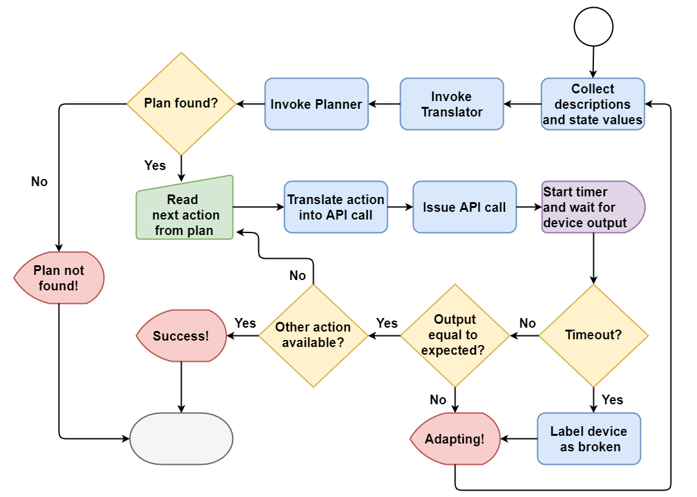

# Smart DT Composer

Smart DT Composer is a software that automatically orchestrate digital twins to accomplish a specified goal. It relies on classical planning, a well-established field of artificial intelligence, and on Bosch IoT Things, a platform to manage digital twins.

  

The image above depicts the system architecture. Its main components are:
* Bosch IoT Things, which provides the API for interacting with the Digital Twins and the actual devices
* Bosch IoT Hub, which allows the devices to securely communicate in a wide range of protocols:
  * It receives the messages from the devices and it forwards them to Bosch IoT Thing
  * It receives the messages from Bosch IoT Thing and it forwards them to the appropriate devices. For the sake of simplicity, in the architecture and in the later example the devices communicate with Bosch IoT Hub via MQTT only

* Context, a file which encodes the following data:
  * Type hierarchy of the domain
  * Definitions and initial state of passive objects
  * PDDL requirements
  * Goal state
* Translator, which takes the Digital Twin descriptions, their current values
and contextual information as inputs and generates the PDDL domain and
problem files
* Planner, a state-of-the-art classical planner (in the example, Fast Downward is
used, which, given the problem and the domain files, generates a sequential
plan
* Engine, which is in charge of performing three sequential tasks:
  1. It collects the Digital Twin descriptions and their current values and send them as an input to the translator, which outputs a PDDL domain and problem files 
  2. It invokes the planner, which takes the two files as input and it outputs a plan, which consists of a linear sequence of actions
  3. It reads the plan action by action and for each one: 
      1. It obtains the correspondent API call. In fact, each action in the plan provides the necessary information to send a command to a device, namely: the name of the task, the thing that has to perform it and the required parameters
      2. It issues the so-generated API call and it waits for the device output
      3. It checks if there is any discrepancy between the device output and the expected output
 
 Below, a picture of the application workflow.
 

  

## Run Smart DT Composer
The src folder includes the modules for the orhestrator and the translator. The device folder, instead, contains a script that emulates a physical device. Before running the software, the following operations must be done:
  * Provision one or more devices in Bosch IoT Things (see Bosch IoT Things documentation)
  * Descript each device following the DTPL conventions
  * Edit the context file to relfect the conditions of the factory environemnt
  * Download and install a PDDL compatible planner
  * Edit the config file to change the credentials
To run the software, execute the Engine.py script.

